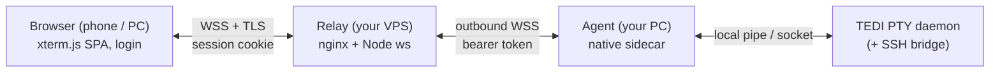

# TEDI Remote Access

Reach the terminals you have open in [TEDI](https://github.com/IlhamriSKY/TEDI)
from a browser anywhere, and open new terminal or SSH tabs straight from that
browser, while your PC is on and TEDI is running. A tiny native agent mirrors
your live tabs to a **relay you host yourself**, so any phone or laptop can
attach over HTTPS.

<p align="center">
  
</p>

> [!NOTE]
> You need TEDI (see `engines.tedi` in `manifest.json` for the minimum version)
> and a **relay you host** — a small VPS with a domain and TLS. The whole relay
> plus website is set up in a few steps below; `server/install.sh` does it all.

Runs on the three operating systems TEDI supports: Windows, macOS, and Linux.

---

## What you can do

- **Mirror your open tabs.** See the exact terminals (and SSH tabs) open on your
  desktop, scrollback included. Typing drives the same PTY, so input shows on
  both. It is a mirror, not a separate shell.
- **Open new tabs from the browser.** The tab strip's **+** opens a **New
  terminal** on the host, or a **New SSH** connection.
- **Safe SSH from the browser.** You can only open SSH hosts you have already
  saved and verified on the desktop (host-key pinned) — you cannot add a new host
  from the web. To connect you re-enter your **login** password, never the SSH
  password: that stays in the host's keychain and never touches the browser.
- **NAT-friendly, no inbound port.** The agent and the browser both dial **out**
  to your relay, so nothing is exposed on your home network. Close TEDI and the
  agent stops; the browser shows the host offline.

## How it works



The agent attaches to TEDI's PTY daemon as a **second subscriber**, so it mirrors
your open sessions without disturbing the desktop. Your relay terminates HTTPS;
the agent presents a bearer token and the browser logs in (password, optional
TOTP), rate-limited. Opening a tab from the browser asks the host to spawn it; an
SSH open is verified by the relay against your login password first.

## Install

1. Open **Settings → Extensions** in TEDI.
2. Switch to the **From GitHub** tab.
3. Paste `IlhamriSKY/TEDI.remote-access` and click **Review → Install**.

## Update

In **Settings → Extensions**, click **Check updates** on this extension's card.
If a new release exists, click **Update** to reinstall in place.

## Configure

Open **Settings → Extensions → Remote Access** and set:

| Setting         | Value                                                              |
| --------------- | ------------------------------------------------------------------ |
| **Relay**       | your relay's domain, e.g. `remote.example.com`                     |
| **Agent token** | the `AGENT_TOKEN` you set on the relay (stored in the OS keychain) |
| **Host label**  | a name shown to the browser (e.g. your PC name)                    |

Enable the extension (the toggle on its card) to start; the status-bar icon shows
the connection state. Then open `https://<your-domain>` on any device, sign in,
and your tabs appear.

## Self-host the relay

The relay is the only public-facing piece: a small VPS that terminates TLS via
nginx, authenticates the **agent** (bearer token) and **browsers** (login
cookie), and pipes opaque frames between them. It never parses terminal data.

```
browser --wss/TLS--> nginx (:443) --proxy--> relay (127.0.0.1:8788) <--wss out-- agent (your PC)
```

You need a VPS with **SSH**, **nginx**, **Node 18+**, and a domain whose A record
points at it. From the extracted release bundle (or a clone), the one-command
setup:

```bash
bash server/install.sh
```

It asks for your domain + login, generates the secrets, builds the website from
`client/`, installs the systemd service + nginx vhost, and prints the **Agent
token** to paste into the extension. Obtain the TLS cert with the `certbot` line
it prints, then re-run it once to switch to HTTPS.

Prefer to do it by hand? The pieces live under `server/`: `server.js` (the relay,
only dependency is `ws`), `gen-hash.js` (scrypt hash for `LOGIN_PASS_HASH`), and
`deploy/` (the systemd unit + the two nginx vhost phases). Build the website with
`cd client && npm run build` (outputs to `server/public`), put your config in
`server/.env` (`AGENT_TOKEN`, `SESSION_SECRET`, `LOGIN_USER`, `LOGIN_PASS_HASH`,
`TRUST_PROXY=1`, plus optional `TOTP_SECRET` and `ALLOWED_ORIGIN`), and run it
under the systemd unit behind the nginx vhost.

**Operate:** `sudo systemctl restart tedi-remote` and
`journalctl -u tedi-remote -f`. To update, rebuild the website and copy the new
`server/public` + `server.js` up, then restart.

## SSH tabs

TEDI keeps each SSH session in the GUI process (not the PTY daemon), so a small
bridge inside `extension.js` mirrors them through the `ssh_*` host commands
(shown with a sky stripe + `ssh` badge in the browser); keystrokes route back via
`ssh_write` and closing via `ssh_close`. Opening a **New SSH** from the browser
goes through `ctx.ssh`: the host opens one of your saved, host-key-pinned
connections using credentials from its own keychain, so the SSH password is never
sent to or seen by the browser. Resize is a deliberate no-op, so the desktop SSH
terminal is never reflowed.

## Permissions

| Permission                                                               | Why                                                                                                                     |
| ------------------------------------------------------------------------ | ----------------------------------------------------------------------------------------------------------------------- |
| `invoke:shell_bg_spawn_direct` / `_logs` / `_kill`                       | Spawn, read the `READY` handshake of, and stop the agent.                                                               |
| `invoke:ssh_list_sessions` / `_attach` / `_write` / `_close` / `_resize` | Mirror SSH tabs and let the browser type into / close them.                                                             |
| `ssh:connections`                                                        | List your saved SSH hosts (metadata only) and open one by id for **New SSH**. The SSH credentials stay in the keychain. |
| `settings:read`                                                          | Read the relay domain and host label.                                                                                   |
| `secrets:read`                                                           | Read the agent token from the OS keychain.                                                                              |
| `ui:toast`                                                               | Connection and error toasts.                                                                                            |
| `statusbar:write`                                                        | The connection-state status-bar icon.                                                                                   |

The agent dials out only; it opens no inbound port. The relay is the single
public surface and is gated by login.

## Security

This exposes a shell to the internet, so treat it like SSH.

- Use a strong relay password and enable **TOTP** (`TOTP_SECRET`). You can change
  the password from the browser (account menu → **Change password**).
- Rotate `AGENT_TOKEN` and the password periodically; rotating `SESSION_SECRET`
  logs everyone out. Set `ALLOWED_ORIGIN` to your domain and keep `TRUST_PROXY=1`.
- The relay binds `127.0.0.1`; only nginx (TLS) faces the net. Consider an nginx
  IP allow-list if your access IPs are stable.

**Built in.** TLS-only (the extension forces `wss://`), constant-time token +
scrypt-login checks, IP rate-limiting, single-use TOTP, connection + frame caps,
a Content-Security-Policy + WebSocket Origin check, and a sandboxed systemd unit.
SSH credentials never leave the host keychain; opening SSH from the browser needs
a fresh login-password re-auth and a browser cannot trigger it with a raw WS
frame.

**Known considerations.** The agent token is on the agent's command line (another
process running as _you_ could read it — rotate it on a shared host); TEDI's
Windows PTY-daemon pipe is not ACL-restricted (a concern only on multi-user / RDP
hosts; the Unix socket is `0600`); and extensions run unsandboxed, so install-time
permission consent is the real trust boundary — install only extensions you trust.

## Development

```bash
git clone https://github.com/IlhamriSKY/TEDI.remote-access.git
cd TEDI.remote-access

# Extension bundle: src/index.js -> extension.js (generated, not committed).
npm install && npm run build

# Native agent (mirrors TEDI -> relay). Copy the binary into sidecar/<os>-<arch>/.
cd sidecar-src && cargo build --release && cd ..

# Browser website (Vite SPA) -> built into server/public.
cd client && npm install && npm run build && cd ..
```

| Path                        | What                                                      | Runs on        |
| --------------------------- | --------------------------------------------------------- | -------------- |
| `manifest.json`, `icon.png` | Extension metadata + icon.                                | TEDI (your PC) |
| `src/`, `build.mjs`         | Extension source, bundled into `extension.js` by esbuild. | build-time     |
| `sidecar-src/`, `sidecar/`  | Rust agent source + CI-built binaries (git-ignored).      | your PC        |
| `client/`                   | Browser website source (React + Tailwind, xterm.js).      | build-time     |
| `server/`                   | Relay (Node `ws`) + `deploy/` (nginx, systemd).           | your VPS       |

To cut a release, bump `manifest.json` + `CHANGELOG.md`, tag `vX.Y.Z`, and push.
CI ([`.github/workflows/release.yml`](.github/workflows/release.yml)) builds the
agent for Windows, macOS (x64 + arm64), and Linux, verifies the website builds,
and uploads the extension `.zip` (which TEDI's installer reads from
`releases/latest`) plus a `.tar.gz` relay/website source bundle to the release.

## License

[Apache-2.0](LICENSE).
