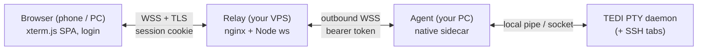

# TEDI Remote Access

Reach the terminals you have open in [TEDI](https://github.com/IlhamriSKY/TEDI)
from a browser anywhere, while your PC is on and TEDI is running. The extension
spawns a tiny native agent that mirrors your live terminal (and SSH) tabs to a
**relay you host yourself**, so any phone or laptop can attach over HTTPS.

<p align="center">
  
</p>

> [!NOTE]
> You need two things: TEDI (see `engines.tedi` in `manifest.json` for the
> minimum version) and a **relay you host** (a small VPS with a domain and TLS).
> The whole relay plus website is set up below in a few steps. SSH-tab mirroring
> also needs a TEDI build that exposes the `ssh_attach` host command (see
> [Mirroring SSH tabs](#mirroring-ssh-tabs)).

Runs on the three operating systems TEDI supports: Windows, macOS, and Linux.

---

## How it works



The agent attaches to TEDI's PTY daemon as a **second subscriber** (the daemon
fans terminal output to every client), so it mirrors the sessions you already
have open without disturbing the desktop UI. It only ever dials **out** to your
relay, so there is no inbound port on your PC. Close TEDI and the agent stops;
the browser shows the host offline.

- **Mirror, not a new shell.** You see the exact terminals open on your desktop, scrollback included. Typing drives the same PTY, so input shows on both.
- **NAT-friendly.** The agent and the browser both connect out to your relay; nothing is exposed on your home network.
- **TLS and auth end to end.** Your relay terminates HTTPS; the agent presents a bearer token, the browser logs in (password, optional TOTP), rate-limited.

## Install

1. Open **Settings > Extensions** in TEDI.
2. Switch to the **From GitHub** tab.
3. Paste `IlhamriSKY/TEDI.remote-access` and click **Review > Install**.

## Configure

Open **Settings > Extensions > Remote Access** and set:

| Setting | Value |
| --- | --- |
| **Relay** | your relay's domain, e.g. `remote.example.com` |
| **Agent token** | the `AGENT_TOKEN` you set on the relay (stored in the OS keychain) |
| **Host label** | a name shown to the browser (for example your PC name) |

Enable the extension itself (the toggle on its card) to start mirroring; disable
it to stop. The status-bar icon shows the connection state.
Then open `https://<your-domain>` on any device, sign in, and your open terminals
appear as tabs.

## Self-host the relay (and website)

The relay is the only public-facing piece. It runs on a small VPS, terminates
TLS via nginx, authenticates the host **agent** (bearer token) and **browser**
clients (login cookie), and pipes opaque frames between them. It never parses
terminal data.

```
browser --wss/TLS--> nginx (:443) --proxy--> relay (127.0.0.1:8788) <--wss out-- agent (your PC)
```

You build the website **from source**; nothing pre-built is shipped. The pieces
you deploy:

| Path | Purpose |
| --- | --- |
| `client/` | The browser UI source (Vite + React + xterm.js). You build it. |
| `server/server.js` | The relay (Node, only dependency is `ws`). |
| `server/package.json`, `server/package-lock.json` | Relay dependencies. |
| `server/gen-hash.js` | Generates the scrypt password hash for `LOGIN_PASS_HASH`. |
| `server/deploy/tedi-remote.service` | systemd unit template. |
| `server/deploy/remote.example.com.http.conf` | nginx phase 1 (ACME challenge only). |
| `server/deploy/remote.example.com.conf` | nginx phase 2 (HTTPS + WS proxy + gzip). |

Requirements: a VPS with **SSH**, **nginx**, **Node 18+**, and a domain whose A
record points at the VPS. The steps below assume `remote.example.com`; replace
it with your domain.

### 1. Get the source onto the VPS

Either clone the repo or download `tedi-remote-relay-<version>.tar.gz` from the
[release](https://github.com/IlhamriSKY/TEDI.remote-access/releases) and extract
it. You should end up with `client/` and `server/` side by side.

```bash
sudo mkdir -p /var/www/html/tedi-remote && sudo chown -R "$USER":"$USER" /var/www/html/tedi-remote
# copy client/ and server/ into /var/www/html/tedi-remote
cd /var/www/html/tedi-remote
```

### 2. Build the website from source

This compiles `client/` into `server/public`, which the relay serves.

```bash
cd client && npm install && npm run build && cd ..
```

### 3. Generate secrets (keep them safe)

```bash
node -e "const c=require('crypto');console.log('AGENT_TOKEN='+c.randomBytes(32).toString('hex'));console.log('SESSION_SECRET='+c.randomBytes(32).toString('hex'))"
node server/gen-hash.js 'a-strong-password'    # prints the salt:hash to paste after LOGIN_PASS_HASH=
```

### 4. Install and configure the relay

```bash
cd server && npm install --omit=dev && cd ..
```

Create `server/.env` (mode 600, **never commit it**):

```ini
PORT=8788
AGENT_TOKEN=<from step 3>
SESSION_SECRET=<from step 3>
LOGIN_USER=admin
LOGIN_PASS_HASH=<from gen-hash.js>
TRUST_PROXY=1
# Optional 2FA: set a base32 secret, add it to your authenticator app, then
# login also requires the 6-digit code.
# TOTP_SECRET=ABCDEFGHIJKLMNOP
```

```bash
chmod 600 server/.env
```

### 5. Run it as a systemd service

Edit `server/deploy/tedi-remote.service` so `ExecStart` points at your `node`
(for an nvm install: `/home/<user>/.nvm/versions/node/<ver>/bin/node`), `User=`
is your account, and `WorkingDirectory=` is `/var/www/html/tedi-remote/server`,
then:

```bash
sudo cp server/deploy/tedi-remote.service /etc/systemd/system/tedi-remote.service
sudo systemctl daemon-reload
sudo systemctl enable --now tedi-remote
systemctl is-active tedi-remote && curl -s http://127.0.0.1:8788/healthz   # -> ok
```

### 6. nginx and TLS (certbot webroot)

```bash
# phase 1: HTTP-only block so certbot can answer the ACME challenge
sed 's/remote.example.com/<your-domain>/g' server/deploy/remote.example.com.http.conf \
  | sudo tee /etc/nginx/conf.d/<your-domain>.conf
sudo nginx -t && sudo systemctl reload nginx
sudo certbot certonly --webroot -w /var/lib/letsencrypt -d <your-domain>

# phase 2: full HTTPS + WebSocket proxy + gzip
sed 's/remote.example.com/<your-domain>/g' server/deploy/remote.example.com.conf \
  | sudo tee /etc/nginx/conf.d/<your-domain>.conf
sudo nginx -t && sudo systemctl reload nginx
```

The vhost proxies everything to `127.0.0.1:8788`, upgrades WebSockets, gzips
JS/CSS/JSON, and serves the website. Open `https://<your-domain>`; you should see
the login page.

### 7. Point the extension at it

In TEDI, set **Relay** to your domain (e.g. `remote.example.com`) and **Agent
token** to the `AGENT_TOKEN` from step 3, then enable it (see
[Configure](#configure)).

### Operate and update

```bash
sudo systemctl restart tedi-remote
sudo journalctl -u tedi-remote -f
```

To update the website: rebuild it (`cd client && npm run build`), copy the new
`server/public` and `server/server.js` up, and `sudo systemctl restart tedi-remote`.

## Mirroring SSH tabs

Local terminals mirror out of the box. SSH tabs are different: TEDI keeps each
SSH session in the GUI process (not the PTY daemon), so the agent cannot see
them. Instead, `extension.js` runs a small bridge in the webview that reads SSH
tabs through the `ssh_list_sessions` and `ssh_attach` host commands and forwards
them to the relay as a second source (shown with a sky stripe and `ssh` badge in
the browser). Browser input routes back through `ssh_write` / `ssh_resize`.

On a TEDI build that exposes those commands this happens automatically; on older
builds the bridge no-ops and only local terminals mirror. The TEDI-core changes
required (`ssh_list_sessions`, `ssh_attach`, and `ctx.invokeChannel`) live in the
main TEDI repo, not this extension.

## Permissions

| Permission | Why |
| --- | --- |
| `invoke:shell_bg_spawn_direct` / `invoke:shell_bg_logs` / `invoke:shell_bg_kill` | Spawn, read the `READY` handshake of, and stop the agent. |
| `invoke:ssh_list_sessions` / `invoke:ssh_attach` / `invoke:ssh_write` / `invoke:ssh_resize` | Mirror SSH tabs (no-ops on builds without these commands). |
| `settings:read` | Read the relay domain and host label. |
| `secrets:read` | Read the agent token from the OS keychain. |
| `ui:toast` | Connection and error toasts. |
| `statusbar:write` | The connection-state status-bar icon. |

The agent dials out only; it opens no inbound port. The relay is the single
public surface and is gated by login.

## Security

This exposes a full shell to the internet, so treat it like SSH:

- Use a strong relay password and enable **TOTP**.
- Rotate `AGENT_TOKEN` and the password periodically; rotating `SESSION_SECRET` logs everyone out.
- The relay binds `127.0.0.1`; only nginx (TLS) faces the net. Consider an nginx `allow`/`deny` IP allow-list if your access IPs are stable.
- The agent token is stored in the OS keychain, never in plaintext on disk or in a process argument.

## Development

```bash
git clone https://github.com/IlhamriSKY/TEDI.remote-access.git
cd TEDI.remote-access

# Native agent (the sidecar that mirrors TEDI -> relay)
cd sidecar-src && cargo build --release && cd ..
# copy the binary into the matching sidecar/<os>-<arch>/ folder, for example:
#   Windows: sidecar/windows-x86_64/tedi-remote-agent.exe
#   macOS:   sidecar/macos-x86_64/  or  sidecar/macos-aarch64/
#   Linux:   sidecar/linux-x86_64/

# Browser website (Vite SPA) -> built into server/public
cd client && npm install && npm run build && cd ..

# Relay (runs on the VPS)
cd server && npm install && cd ..
```

Repo layout:

| Path | What | Runs on |
| --- | --- | --- |
| `manifest.json`, `extension.js`, `icon.png` | The installable extension (spawns the agent, status bar, config). | TEDI (your PC) |
| `sidecar-src/` | Rust agent source. | build-time |
| `sidecar/` | CI-built agent binaries, per OS/arch (git-ignored; in the release zip). | your PC |
| `client/` | Browser website source (React + Tailwind + shadcn, xterm.js). | build-time |
| `server/` | Relay (Node `ws`) + `deploy/` (nginx, systemd). | your VPS |

To cut a release, bump `manifest.json` + `CHANGELOG.md`, tag `vX.Y.Z`, and push.
CI ([`.github/workflows/release.yml`](.github/workflows/release.yml)) builds the
agent for Windows, macOS (x64 + arm64), and Linux, verifies the website builds,
packages the extension `.zip` (which TEDI's installer reads from
`releases/latest`) plus a `.tar.gz` source bundle of the relay and website, and
uploads both to the GitHub release. The release job uses the workflow's built-in
`GITHUB_TOKEN`.

## License

[Apache-2.0](LICENSE).
