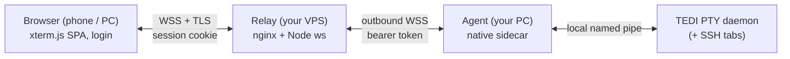

# TEDI Remote Access

Reach the terminals you have open in [TEDI](https://github.com/IlhamriSKY/TEDI)
from a browser anywhere, while your PC is on and TEDI is running. The extension
spawns a tiny native agent that mirrors your live terminal (and SSH) tabs to a
**self-hosted relay**, so any phone or laptop can attach over HTTPS.

<p align="center">
  
</p>

> [!NOTE]
> Requires TEDI >= 0.3.42 (see `engines.tedi` in `manifest.json`, the
> authoritative value) and a **relay you host yourself** (a small VPS with a
> domain + TLS). See [server/README.md](server/README.md) to stand one up in a
> few minutes. SSH-tab mirroring additionally needs a TEDI build that exposes
> the `ssh_attach` host command (see [Mirroring SSH tabs](#mirroring-ssh-tabs)).

---

## How it works



The agent attaches to TEDI's PTY daemon as a **second subscriber** (the daemon
fans terminal output to every client), so it mirrors the sessions you already
have open without disturbing the desktop UI. It only ever dials **out** to your
relay, so there is no inbound port on your PC. Close TEDI and the agent stops;
the browser shows the host offline.

- **Mirror, not a new shell** — you see the exact terminals open on your desktop, scrollback included. Typing drives the same PTY, so input shows on both.
- **NAT-friendly** — the agent and the browser both connect out to your relay; nothing is exposed on your home network.
- **TLS + auth end to end** — your relay terminates HTTPS; the agent presents a bearer token, the browser logs in (password, optional TOTP), rate-limited.

## Install

1. Open **Settings → Extensions** in TEDI.
2. Switch to the **From GitHub** tab.
3. Paste `IlhamriSKY/TEDI.remote-access` and click **Review → Install**.

## Configure

Open **Settings → Extensions → Remote Access** and set:

| Setting | Value |
| --- | --- |
| **Relay URL** | `wss://<your-domain>/agent` |
| **Agent token** | the `AGENT_TOKEN` you set on the relay (stored in the OS keychain) |
| **Host label** | a name shown to the browser (e.g. your PC name) |
| **Enable remote access** | turn **on** |

The status-bar icon shows the connection state. Toggle anytime with **Ctrl+Alt+R**.

Then open `https://<your-domain>` on any device, sign in, and your open terminals
appear as tabs.

## Self-hosting the relay

The browser UI (`client/`) and the relay (`server/`) run on your VPS, not in the
extension. Full setup (nginx vhost, systemd service, Let's Encrypt, secrets) is
in **[server/README.md](server/README.md)**.

## Mirroring SSH tabs

Local terminals mirror out of the box. SSH tabs (TEDI's `ssh/` module) live in
the GUI process rather than the PTY daemon, so the agent reads them through the
`ssh_list_sessions` / `ssh_attach` host commands. On a TEDI build that exposes
those commands the extension mirrors SSH tabs automatically (shown with a sky
stripe + `ssh` badge in the browser); on older builds it silently mirrors local
terminals only. See [docs/ARCHITECTURE.md](docs/ARCHITECTURE.md).

## Permissions

| Permission | Why |
| --- | --- |
| `invoke:shell_bg_spawn_direct` / `invoke:shell_bg_logs` / `invoke:shell_bg_kill` | Spawn, read the `READY` handshake of, and stop the agent. |
| `settings:read` / `settings:write` | Relay URL, host label, enabled flag. |
| `secrets:read` / `secrets:write` | Store the agent token in the OS keychain. |
| `ui:toast` | Connection / error toasts. |
| `statusbar:write` | The connection-state status-bar icon. |

The agent dials out only; it opens no inbound port. The relay is the single
public surface and is gated by login.

## Security

This exposes a full shell to the internet, so treat it like SSH:

- Use a strong relay password and enable **TOTP** (see server/README.md).
- Rotate `AGENT_TOKEN` / the password periodically.
- The relay binds `127.0.0.1`; only nginx (TLS) faces the net. Consider an nginx IP allow-list if your access IPs are stable.

## Development

```bash
git clone https://github.com/IlhamriSKY/TEDI.remote-access.git
cd TEDI.remote-access

# Native agent (the sidecar that mirrors TEDI -> relay)
cd sidecar-src && cargo build --release && cd ..
mkdir -p sidecar/windows-x86_64
cp sidecar-src/target/release/tedi-remote-agent* sidecar/windows-x86_64/   # adjust per platform

# Browser client (Vite SPA) -> built into server/public
cd client && npm install && npm run build && cd ..

# Relay (runs on the VPS)
cd server && npm install && cd ..
```

Repo layout:

| Path | What | Runs on |
| --- | --- | --- |
| `manifest.json`, `extension.js`, `icon.png` | The installable extension (spawns the agent, status bar, config). | TEDI (your PC) |
| `sidecar-src/` | Rust agent source. | build-time |
| `sidecar/` | CI-built agent binaries (git-ignored; in the release zip). | your PC |
| `client/` | Browser SPA source (React + Tailwind + shadcn, xterm.js). | build-time |
| `server/` | Relay (Node `ws`) + `deploy/` (nginx, systemd) + built `public/`. | your VPS |

To cut a release, bump `manifest.json` + `CHANGELOG.md`, tag `vX.Y.Z`, and push.
CI ([`.github/workflows/release.yml`](.github/workflows/release.yml)) builds the
agent for every platform, packages the extension `.zip` (which TEDI's installer
reads from `releases/latest`) plus a ready-to-deploy `relay.zip`, and uploads
both to the GitHub release. No PAT needed — the release job uses the workflow's
built-in `GITHUB_TOKEN`.

## License

[Apache-2.0](LICENSE).
